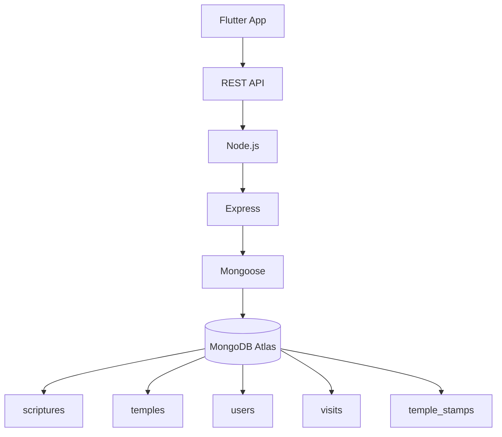

# 🪷 Digital Pilgrimage

<p align="center">
  <b>Ứng dụng tra cứu chùa, kinh chú và trải nghiệm hành hương số</b>
</p>

<p align="center">
  Một ứng dụng Flutter hỗ trợ người dùng tìm hiểu Phật giáo, tra cứu thông tin chùa,
  đọc kinh chú và lưu lại hành trình viếng chùa dưới hình thức số hóa.
</p>

<p align="center">
  
  
  
  
  
</p>

---

## 📖 Giới thiệu

**Digital Pilgrimage** là ứng dụng di động được xây dựng nhằm hỗ trợ người dùng trong quá trình tìm hiểu và trải nghiệm hành hương.

Ứng dụng hướng đến việc kết hợp nội dung Phật giáo với công nghệ hiện đại thông qua các chức năng như tra cứu chùa, đọc kinh chú, quét mã tại chùa và lưu lại những lần viếng chùa trong hồ sơ cá nhân.

> 🪷 Công nghệ hỗ trợ trải nghiệm hành hương — không thay thế trải nghiệm tôn giáo thực tế.

---

## ✨ Tính năng

### 🏠 Trang chủ

Hiển thị các nội dung tổng quan như:

- Lịch tuần
- Thông tin ngày
- Nội dung Phật pháp
- Câu kinh / lời dạy mỗi ngày
- Gợi ý khám phá chùa

### 📖 Kinh sách

Người dùng có thể:

- Xem danh sách kinh và chú
- Tìm kiếm nội dung
- Xem thông tin chi tiết
- Đọc nội dung kinh
- Phân loại giữa **Kinh** và **Chú**

Dữ liệu Kinh sách được quản lý thông qua backend và MongoDB.

### 🛕 Tra cứu chùa

Hiển thị:

- Tên chùa
- Địa chỉ
- Giới thiệu
- Lịch sử
- Hình ảnh
- Thông tin liên quan

### 📷 QR Scanner

Người dùng có thể quét QR tại chùa để truy cập nhanh thông tin.

Ví dụ QR payload:

```text
TEMPLE:chua-giac-lam
```

Ứng dụng đọc ID của chùa và truy xuất thông tin tương ứng từ hệ thống.

### 📱 NFC

Dự kiến hỗ trợ NFC tại các chùa được tích hợp.

Khi người dùng đưa điện thoại đến NFC Tag:

```text
NFC Tag
    ↓
Temple ID
    ↓
Backend API
    ↓
Thông tin chùa
```

### 🏮 Digital Temple Stamp

Người dùng có thể nhận **tem viếng chùa điện tử** sau khi thực hiện chuyến viếng.

Tem được lưu vào hồ sơ cá nhân như một dạng:

```text
Digital Temple Stamp
       +
Pilgrimage History
```

### 👤 Hồ sơ cá nhân

Dự kiến bao gồm:

- Thông tin người dùng
- Lịch sử viếng chùa
- Bộ sưu tập tem
- Kinh yêu thích
- Hoạt động gần đây

---

# 🏗️ Kiến trúc hệ thống



Kiến trúc tổng quát:

```text
Flutter
   │
   │ HTTP / JSON
   ▼
Node.js + Express
   │
   │ Mongoose
   ▼
MongoDB Atlas
```

Flutter **không kết nối trực tiếp với MongoDB**.

Backend chịu trách nhiệm giao tiếp với database và cung cấp REST API cho ứng dụng.

---

# 🛠️ Công nghệ sử dụng

| Thành phần | Công nghệ |
|---|---|
| Mobile / Frontend | Flutter |
| Ngôn ngữ Frontend | Dart |
| Backend | Node.js |
| API Framework | Express.js |
| Database | MongoDB Atlas |
| ODM | Mongoose |
| QR Scanner | mobile_scanner |
| IDE | Visual Studio Code / Android Studio |
| Version Control | Git + GitHub |

---

# 📂 Cấu trúc project

```text
digital-pilgrimage-app/
│
├── android/
│
├── assets/
│   └── images/
│
├── backend/
│   │
│   ├── data/
│   │   ├── scriptures.json
│   │   └── temples.json
│   │
│   ├── src/
│   │   ├── config/
│   │   │   └── database.js
│   │   │
│   │   ├── controllers/
│   │   │
│   │   ├── models/
│   │   │
│   │   ├── routes/
│   │   │
│   │   └── server.js
│   │
│   ├── .env
│   ├── .env.example
│   ├── package.json
│   └── package-lock.json
│
├── lib/
│   │
│   ├── models/
│   │
│   ├── services/
│   │
│   ├── views/
│   │   ├── chua/
│   │   ├── kinh_sach/
│   │   ├── lich/
│   │   ├── qr/
│   │   ├── tai_khoan/
│   │   └── trang_chu/
│   │
│   ├── widgets/
│   │
│   └── main.dart
│
├── pubspec.yaml
│
└── README.md
```

---

# 🗄️ Database

Database chính:

```text
hanh_huong_db
```

Cấu trúc dự kiến:

```text
hanh_huong_db
│
├── scriptures
│
├── temples
│
├── users
│
├── visits
│
└── temple_stamps
```

### `scriptures`

Ví dụ:

```json
{
  "title": "Kinh Pháp Cú",
  "slug": "kinh-phap-cu",
  "type": "Kinh",
  "description": "Tuyển tập những lời dạy...",
  "content": "...",
  "source": "Kinh Pháp Cú",
  "order": 1,
  "featured": true
}
```

### `temples`

Ví dụ:

```json
{
  "name": "Chùa Giác Lâm",
  "slug": "chua-giac-lam",
  "address": "...",
  "description": "...",
  "qrCode": "TEMPLE:chua-giac-lam"
}
```

---

# 🌐 API

Backend chạy mặc định tại:

```text
http://localhost:3000
```

Kiểm tra server:

```http
GET /
```

Response:

```json
{
  "success": true,
  "message": "Digital Pilgrimage API is running"
}
```

Một số API dự kiến:

```text
GET    /api/scriptures
GET    /api/scriptures/:slug

GET    /api/temples
GET    /api/temples/:slug
```

---

# 🚀 Cài đặt project

## 1. Clone repository

```bash
git clone https://github.com/DatPNguynXzyU/digital-pilgrimage-app.git
```

Đi vào project:

```bash
cd digital-pilgrimage-app
```

---

## 2. Cài Flutter dependencies

```bash
flutter pub get
```

Kiểm tra môi trường:

```bash
flutter doctor
```

---

## 3. Cài Backend dependencies

```bash
cd backend
npm install
```

---

## 4. Cấu hình MongoDB

Tạo:

```text
backend/.env
```

Có thể copy từ:

```text
backend/.env.example
```

Ví dụ:

```env
PORT=3000

MONGODB_URI=your_mongodb_connection_string

MONGODB_DATABASE=hanh_huong_db
```

> ⚠️ Không được commit `.env` lên GitHub.

---

## 5. Chạy Backend

Trong thư mục:

```text
backend/
```

chạy:

```bash
npm run dev
```

Nếu thành công:

```text
MongoDB connected successfully

Server running at http://localhost:3000
```

---

## 6. Chạy Flutter

Mở terminal khác tại thư mục gốc project.

### Chrome

```bash
flutter run -d chrome
```

### Android

Kiểm tra device:

```bash
flutter devices
```

Sau đó:

```bash
flutter run -d emulator-5554
```

---

# 💻 Localhost

### Flutter Web

Sử dụng:

```text
http://localhost:3000
```

### Android Emulator

Sử dụng:

```text
http://10.0.2.2:3000
```

Bởi vì:

```text
localhost
```

trong Android Emulator chính là emulator, không phải máy tính host.

---

# 👥 Làm việc nhóm

Không nên code feature trực tiếp trên `main`.

Tạo branch:

```bash
git checkout -b feature/ten-chuc-nang
```

Ví dụ:

```bash
git checkout -b feature/scripture-page
```

Sau khi hoàn thành:

```bash
git add .

git commit -m "Add scripture page"

git push -u origin feature/scripture-page
```

Sau đó tạo **Pull Request** trên GitHub.

Workflow:

```text
main
 │
 ├── feature/scripture-page
 │
 ├── feature/temple-page
 │
 ├── feature/user-profile
 │
 └── fix/qr-scanner
```

---

# 📦 Quản lý dữ liệu bằng GitHub

MongoDB database **không nằm trong GitHub**.

GitHub lưu:

```text
Source Code
+
Dữ liệu nguồn
```

MongoDB Atlas lưu:

```text
Database đang chạy
```

Đối với dữ liệu tương đối cố định như:

```text
Kinh sách
Thông tin chùa
```

có thể lưu trong:

```text
backend/data/
```

Ví dụ:

```text
backend/data/scriptures.json
backend/data/temples.json
```

Thành viên trong nhóm có thể sửa JSON:

```text
scriptures.json
```

sau đó:

```bash
git add backend/data/scriptures.json

git commit -m "Add Bat Nha Tam Kinh"

git push
```

Sau khi được merge:

```text
GitHub
   ↓
JSON
   ↓
Seed Script
   ↓
MongoDB Atlas
```

---

# 🔐 Bảo mật

Không bao giờ commit:

```text
.env
MongoDB Password
API Secret
Private Key
node_modules/
```

File:

```text
backend/.gitignore
```

nên chứa:

```gitignore
.env
node_modules/
```

Nếu MongoDB password từng bị push công khai lên GitHub, cần đổi password trên MongoDB Atlas.

---

# 🗺️ Roadmap

```text
✅ Flutter project setup
✅ Bottom navigation
✅ Trang chủ cơ bản
✅ QR Scanner
✅ Node.js backend
✅ Express server
✅ MongoDB Atlas connection

🚧 Kinh sách API
🚧 Kinh sách UI
🚧 Temple database
🚧 QR → Temple integration

⬜ User authentication
⬜ Visit history
⬜ Digital Temple Stamp
⬜ NFC integration
⬜ Favorite scriptures
⬜ Production deployment
```

---

# 🪷 Mục tiêu dự án

Digital Pilgrimage hướng đến việc xây dựng một ứng dụng đơn giản, dễ sử dụng và có giá trị trong việc hỗ trợ người dùng:

```text
Tìm hiểu
   ↓
Khám phá
   ↓
Hành hương
   ↓
Lưu giữ hành trình
```

---

<p align="center">

### 🪷 Digital Pilgrimage

**Technology meets spiritual journey.**

Built with Flutter 💙

</p>
